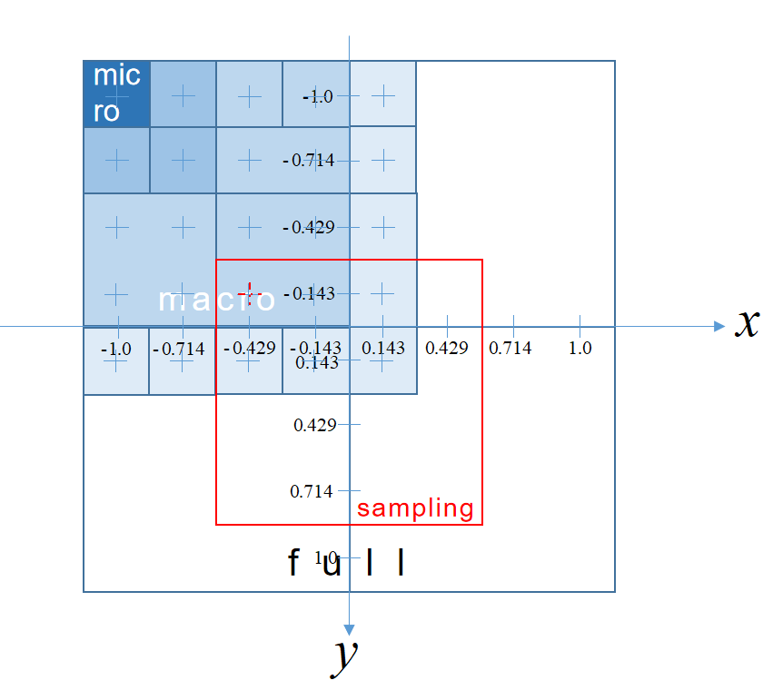

# CoCoGAN_pytorch_master
&nbsp;&nbsp;&nbsp;&nbsp;&nbsp;&nbsp;&nbsp;&nbsp;This is a pytorch-implementation for the base ideas of "Patch Generation" in "[COCO-GAN: Generation by Parts via Conditional Coordinating](https://hubert0527.github.io/COCO-GAN/)". 

# Profile
&nbsp;&nbsp;&nbsp;&nbsp;&nbsp;&nbsp;&nbsp;&nbsp;Well, we did not do an "honest" implementation such as following the network architectures introduced in the paper :smile:. Instead​ :joy:, we followed the base ideas "**Patch Generation and Spatial Relationship + Consistency**" and we implement this based on the original `pytorch` project for **StyleGAN**.<br/>
&nbsp;&nbsp;&nbsp;&nbsp;&nbsp;&nbsp;&nbsp;&nbsp;Since of our poor English and expression skills, in the following part, we will describe **HOW we establish the implementation of `CoCo-GAN` step by step with `StyleGAN`** with a mixing of English and Chinese.

# 欧几里得坐标系统

我们根据配置 `Config/CelebA_128x128_N4M4S64.yaml` 画出坐标系统。

其中`N4M4` 表示一个 macro patch 由 `4x4` 个 micro patches 组成；`S64` 表示一个 macro patch 的像素大小是 `64x64`；`CelebA` 表示训练数据集；`128x128` 表示整图的大小。 



# 复现

- 我们训练的配置是 `Config/CelebA_128x128_N2M2S64.yaml`
- 我们从一个现有的 `noise2img` 的 `GAN` 开始，为了便于不同的 `config` 设置，需要 `Generator` 和 `Discriminator` 能够自适应超参数（e.g. `macro patch size`, `micro patch size`, `ratio of macro to micro`, etc.），我们选择 `ProGAN`，由于我之前已经非常熟悉 `StyleGAN`，我们在它上面一步步改进。

1. Make sure the progressive generation on a sample dataset of `CelebA`(807 faces).

   ```sh
   ## Cmd: 
   CUDA_VISIBLE_DEVICES=0 python train.py --loss r1 --sched --mixing datasets/celeba
   ```

   (iteration: 5800, size: 8×8)

   

   我们只是在一个只有 806 张图像的 CelebA 子集上训练，首先我们要确保这个数据集是可用的，因此我们直接在最开始的 `StyleGAN` 上训练；基于经验，从上图我们就可以认为基于这个小数据集训练时可行的。

2. Make sure the direct generation(w/o progressive) for any target size(e.g. 64×64) on the sample dataset.

   ```sh
   ## Cmd: 
   CUDA_VISIBLE_DEVICES=0 python train_nopro.py --loss r1 --sched --mixing datasets/celeba
   ```

   (iteration: 5200, size: 64×64)

   

   下面我们就要保证取消 `Progressive training strategy` ，直接生成目标 micro patch 大小的整图是否可行？如 `32x32`，`64x64` 等。

3. Make sure learning the patch consistency is possible.

   ```sh
   ## Cmd: 
   CUDA_VISIBLE_DEVICES=0 python train_patches_consistency.py --loss r1 --sched --mixing datasets/celeba
   ```

   (iteration: 102200, size: (4, 32, 32, 3)→(1, 64, 64, 3))

   

   > 现在我们需要证明，`GAN` 学习 `patch generation` 和 `patch consistency`(即当整图分多个 patches 合成时，相邻 patches 之间的内容衔接是兼容的)。
   >
   > 我们将整图均分为 4 个 patches，对应坐标为：
   >
   ```python
   [0][1]
   [2][3]
   '''
   [0] -> (-1.0,  1.0)
   [1] -> ( 1.0,  1.0)
   [2] -> (-1.0, -1.0)
   [3] -> ( 1.0, -1.0)
   '''
   # 我们让 noise 的 dim 为 512-2，在 510-dim 的 style vector 后面拼接上 2-dim 的坐标信息
   ```
   >
   > `G` 输出 4 个 micro patches 整合成一个 macro patch 后输入给 `D` 鉴别。

4. Make sure learning the spatial relationship is also possible.

   ```sh
   # Cmd for training:
   CUDA_VISIBLE_DEVICES=0 python train_spatial_relationship.py --loss r1 --sched --mixing --path datasets/celeba --config=configs/CelebA_128x128_N2M2S64.yaml
   # Cmd for testing:
   CUDA_VISIBLE_DEVICES=0 python test_spatialR.py --config=configs/CelebA_128x128_N2M2S64.yaml
   ```

   (iteration: 128600, size: (4, 32, 32, 3)→(1, 64, 64, 3))

   

   下面我们要证明，`GAN` 可以根据不同的坐标信息生成图像对应的部分而不仅仅是生成整图。

   > 原图 128x128，被划分为 2x2 个 macro patches（64x64）；
   >
   > 每个 macro patch 被划分为 2x2 个 micro patches（32x32）;
   >
   > 我们增加了 projection discriminator 到 `StyleGAN` 的鉴别器中，`G` 和 `D` 接收的分别是 micros 和 macro 的坐标作为 condition；
   >
   > 但我们还没有增加额外的 coordinate consistency loss。

   We also do the test to generate a full image.

   |  |  |
   | :----------------------------------------------------------: | :----------------------------------------------------------: |
   | 目前为止可以保持 patch 之间的一致性，<br/>但是 coord 的作用还不强，<br/>大部分是上图这样无法凑成自然人脸的 |         很难才找到的一个比较自然的样本<br/>约 1/256          |

   

   Thus, the *spatial consistency loss* is necessary.

5. Add *Spatial Consistency Loss*.

   现在我们希望 `GAN` 可以学习到生成的 micro patches 或 macro patch 与对应的 coordinate info 是严格对应的，因此我们加入 `Spatial Consistency Loss`

   ```sh
   # Cmd for training:
   CUDA_VISIBLE_DEVICES=0 python train_coco.py --loss r1 --sched --mixing --path datasets/celeba --config=configs/CelebA_128x128_N2M2S64.yaml
   # Cmd for testing:
   CUDA_VISIBLE_DEVICES=0 python test_coco.py --config=configs/CelebA_128x128_N2M2S64.yaml
   ```
   
   **Trial 1**
   
   In our first trial with `coord_loss_w = 1` and `code_dim = 510 + 2`, the results is not so good but a bit better than the case w/o.
   
   
   
   **Trial 2**
   
   Then we increase the weight subject to `coord_loss_w = 10` and `code_dim = 254 + 2`, the results are much better. 
   
   (Ckp: 150000.model)
   
   

|  |  |  |  |  |  |
| :-----------------------: | :-----------------------: | :-----------------------: | :-----------------------: | ------------------------- | ------------------------- |
|  |  |  |  |  |  |
|  |  |  |  |  |  |

For further experiments, we will follow continuously. (得去做毕设了😭)

# References

[1] [CoCo-GAN *The official `tensorflow`-implementation*](https://github.com/hubert0527/COCO-GAN)

[2] [StyleGAN *The official `tensorflow`-implementation*](https://github.com/NVlabs/stylegan)

[3] A `pytorch`-implementation for `StyleGAN` but we cannot find the source now.
